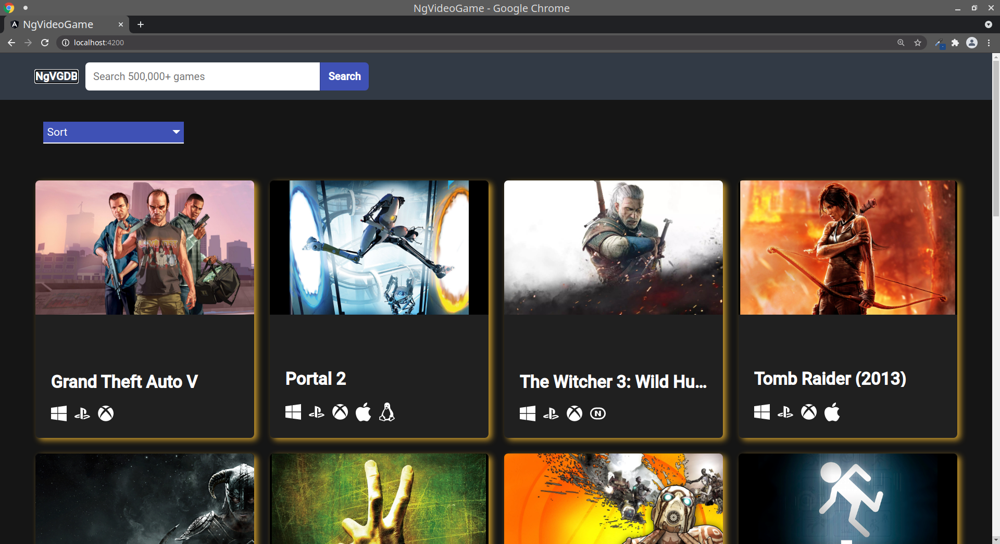
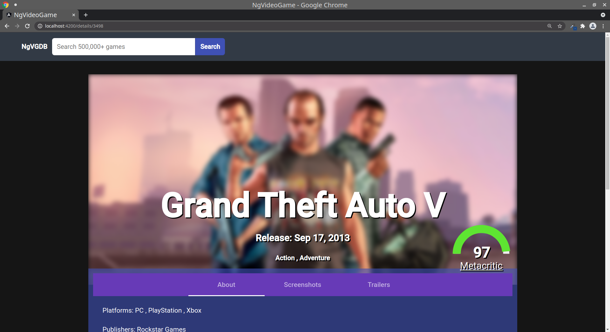
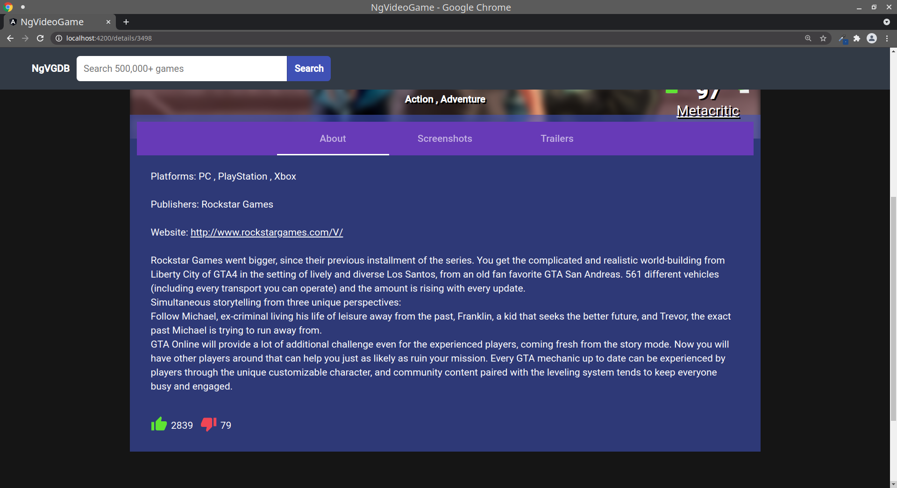
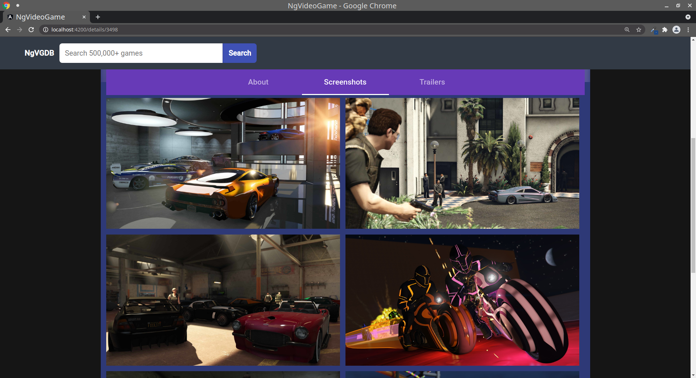
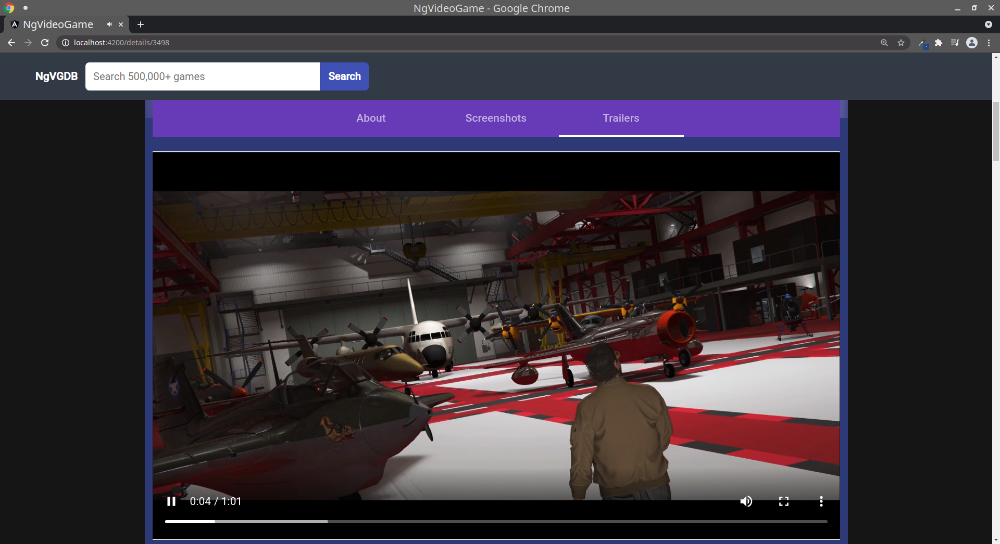

# NgVideoGame
### Simple Angular Application that uses Rapid API of RAWG Video Games Database.
### I have created this project by learning from FreeCodeCamp YouTube tutorial on Angular.

# Tools
1. Angular CLI
2. Angular Material Theme
3. Angular Gauge
4. Rapid API - RAWG Video Games DB

# Useful Links
### Rapid API Link - [RAWG Video Games DB](https://rapidapi.com/accujazz/api/rawg-video-games-database) 
### FreeCodeCamp tutorial Link - [Angular project](https://www.youtube.com/watch?v=LiOzTQAz13Q)

# ScreenShots

| Home Page | Game Details  |
| - | - |
|  |  |

| Game Info Tab | Game Screenshots Tab | Game Trailers Tab |
| - | - | - |
|  |  |  | 
